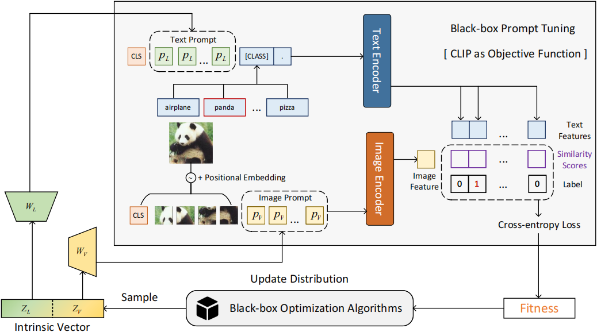

<!-- omit in toc -->
# Black-box Prompt Tuning for Vision-Language Model as a Service
This repo contains the source code of our research project aiming to perform prompt tuning on  vision-language models like [CLIP](https://arxiv.org/abs/2103.00020) in a *derivative-free* manner.

<!-- omit in toc -->
## Updates
- **2022/11/21:** Support parallel evaluation for all indivisuals in the same generation. :art:
- **2022/10/20:** Release the deep variant of prompt tuning for BPT-VLM. :confetti_ball:	
- **2022/09/28:** Release the first version of BPT-VLM. :star:

<!-- omit in toc -->
## Table of Contents
- [Introduction](#introduction)
- [Experiments](#experiments)
- [Prepare Environments](#prepare-environments)
- [Prepare Datasets](#prepare-datasets)
- [Quick Start](#quick-start)
- [Black-box Prompt Tuning](#black-box-prompt-tuning)
## Introduction
In the scenario of Model-as-a-Service (MaaS), large-scale pretrained models (PTMs) are usually released as inference APIs, users are allowed to query those PTMs with manually crafted prompts. It's tricky to conduct continuous prompt tuning on MaaS, especially for vision-language models (VLMs) in consideration of cross-modal interaction. BPT-VLM aims to  optimize continuous visual and linguistic prompts for VLMs in a derivative-free manner.


## Experiments
Algorithm|MM-ES-Shallow|MA-ES-Shallow|CMA-ES-Shallow|CMA-ES-Deep
:--|:--:|:--:|:--:|:--:
ImageNet    |--   |--   |65.08|64.84
SUN397      |--   |--   |68.01|69.83
caltech101  |93.67|93.59|94.16|93.39
OxfordPets  |90.49|90.57|90.43|90.62
StanfordCars|62.49|65.03|64.72|67.84
Food101     |81.62|80.89|81.31|81.38
DTD         |48.40|59.63|60.52|64.13
EuroSAT     |86.25|86.93|86.11|89.37
UCF-101     |70.76|76.34|74.62|76.66
Average     |--   |--   |76.11|77.56

## Prepare Environments
This code is built-on two open-source libraries [PyCMA](https://github.com/CMA-ES/pycma) and [PyPop7](https://github.com/Evolutionary-Intelligence/pypop), so you need to install these two packages first.
```
pip install pycma pypop7
```
After that, run following commands to install other environments required by our project.
```
pip install torch==1.11.0+cu113
pip install pyyaml
pip install ftfy
pip install regex
pip install transformers
pip install overrides
pip install spacy
```
## Prepare Datasets
Follow [DATASET.md](DATASET.md) to install the datasets.

## Quick Start
You can use our pretrained prompt tokens to perform classification on downstream datasets. Generally, a checkpoint  directory is structured like this:
```
$RESULT/
├── caltech101
│   ├── caltech101_deep_cma_ViT-B-32.pth
│   └── caltech101_shallow_cma_ViT-B-32.pth
```
With dataset correctly installed, execute following commands to run a demo:
```bash
python demo.py --checkpoint_dir [$RESULT] --task_name caltech101 --opt shallow_cma --checkpoint_name caltech101
``` 
- Make sure you correctly relate `__dataset__` and `__output__` in [demo.py](demo.py) to the dataset and checkpoint directories.   
- Argument `opt` requires an algorithm name included in `[shallow_cma, shallow_mmes, shallow_lmmaes, deep_cma]`.
- Use the *checkpoint* tuned on `checkpoint_name` to perform evaluation on `task_name` *dataset*.    
  
## Black-box Prompt Tuning
To reproduce the results of black-box prompt tuning, make sure you correctly relate `__dataset__` and `__output__` in [BBT_VL_Shallow.py](BBT_VL_Shallow.py) (or in [BBT_VL_Deep.py](BBT_VL_Deep.py)) to the dataset and checkpoint directories.

Step 1: Set the hyper-parameters in `configs/shallow_prompt.yaml` (or in `configs/deep_prompt.yaml`)

- Hyper-parameters like `population size`, `intrinsic dimension` and `prompt token numbers`.    
  
Step 2: Run following commands:
```bash
# Shallow Prompt Tuning
python python BBT_VL_Shallow.py --task_name caltech101 --opt shallow_cma [--parallel]
# Deep Prompt Tuning
python python BBT_VL_Deep.py --task_name caltech101 --opt deep_cma [--parallel]
```
- `--parallel` is optinal to  support parallel black-box tuning for `[shallow_cma,deep_cma]`. That is, you can evaluate a population of solutions in parallel by putting them into a single large batch. 
